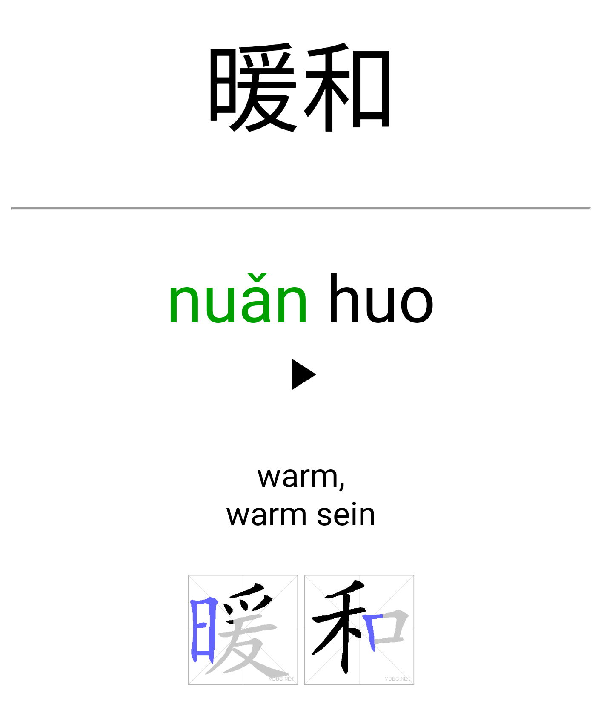
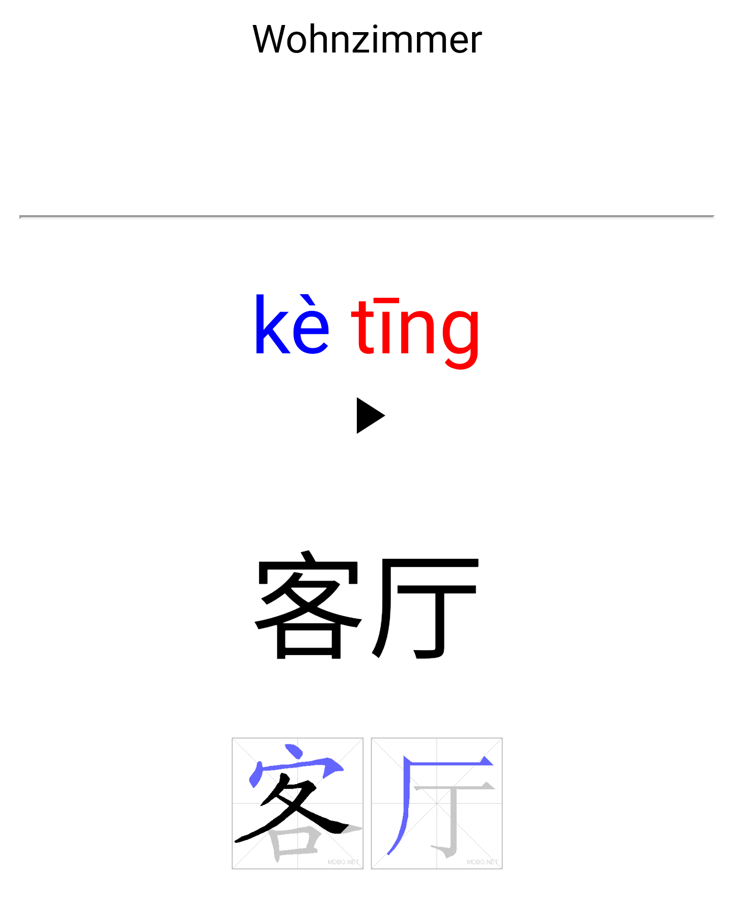
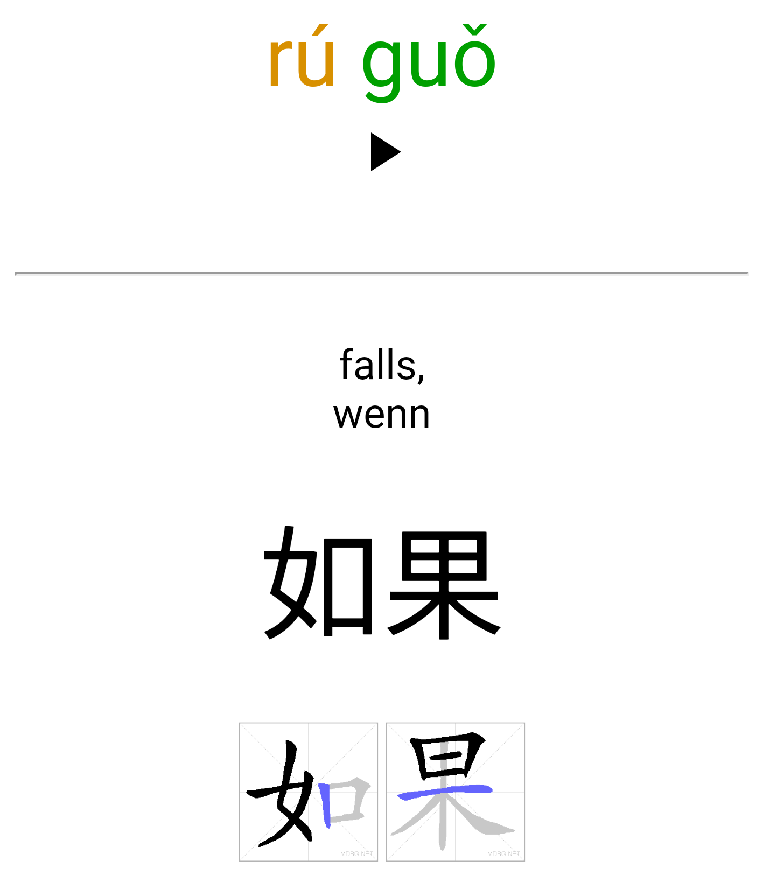

# Anki-HanyuShuipingKaoshi
Anki Cards for the HSK vocabulary Chinese-German

<br>
<br>

<div align="center">
    
    
    
</div>

<br>

Das Deck baut auf folgenden Quellen auf:
* [China Endecken](https://github.com/DanBmh/Anki-ChinaEntdecken)
* Wortschatz von [wohok.com](https://wohok.com/mandarin/hsk_test/hsk1/ger/vocabulary.html)
* [Official Domino Chinese Level 1-20 Complete Vocabulary](https://ankiweb.net/shared/info/722819818)
* [Most Common 3000 Chinese Hanzi Characters](https://ankiweb.net/shared/info/39888802) \
  Tabelle: [Most Common 3000 Chinese - ANKI with Traditional.csv](https://docs.google.com/spreadsheets/d/1j5-67vdCUeAuIzmikeCgNmXaFZTuXtT4vesjnrqSOjI/edit?usp=sharing)

<br>

## Lernen

* Installiere [Anki](https://apps.ankiweb.net/)
* Füge die Erweiterung [CrowdAnki](https://ankiweb.net/shared/info/1788670778) hinzu (Anki->Extras->Erweiterungen)
* Füge dieses Deck hinzu (Anki->Datei->CrowdAnki import from disk/github)

#### Praktische Einstellungen
* Neue Karten zufällig (Stapel->HSK Optionen->Neue Karten->Reihenfolge)
* Zeit für nächste Wiederholung ausblenden (Anki->Extras->Einstellungen->Einfach)
* Zähler für verbleibende Karten ausblenden (Anki->Extras->Einstellungen->Einfach)
* Nur eine Richtung lernen (Anki->Extras->Auswahlstapel erstellen->Suche `"deck:Hanyu Shuiping Kaoshi" card:Hanzi (is:due OR is:new)`)
* Spezielle Level und eine Richtung (Anki->Extras->Auswahlstapel erstellen->Suche `"deck:Hanyu Shuiping Kaoshi" card:Hanzi (tag:Buch_2::Kapitel_4 OR tag:Buch_2::Kapitel_5) (is:due OR is:new)`)

<br>

## Generating the deck

Install required libraries:
```bash
pip3 install --upgrade -r requirements.txt
```

The directory structure should look like this:
```bash
AnkiDecks
    Anki-HanyuShuipingKaoshi                                <- This Repository
        media
        *.py
        Anki-HanyuShuipingKaoshi.json
        ...
    Anki-ChinaEntdecken                                     <- Exported with CrowdAnki
    Chinese__Most_Common_3000_Hanzi                         <- Exported with CrowdAnki
    Domino_Chinese_Level_1-20_Complete_Vocabulary           <- Exported with CrowdAnki
    Most Common 3000 Chinese - ANKI with Traditional.csv    
```

To generate the audio files, an additional free Api-Key for the [Google Text-to-Speech Service](https://cloud.google.com/text-to-speech/) is required. Export it to the shell before running the script, see [audio_tools.py](audio_tools.py).

Run scripts:
```bash
./get_source_vocab
python3 extract_source_vocab.py
python3 create_notes.py
python3 add_strokes.py
python3 add_audios.py
python3 combine_decks.py
```
